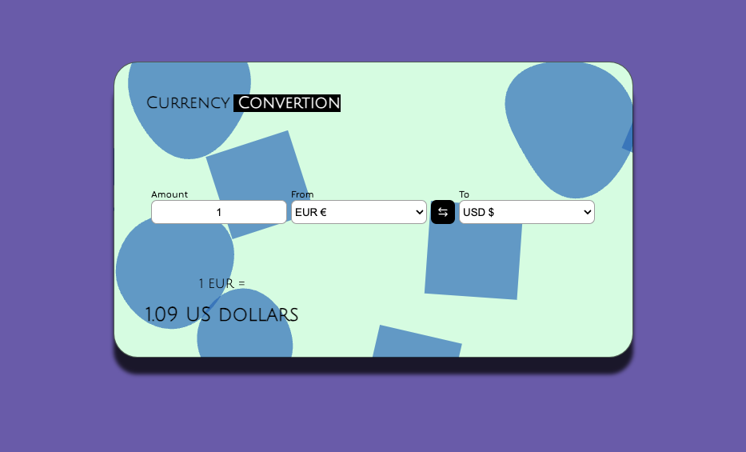

# Conversor de Monedas - Prueba Técnica Front-end



Prueba técnica desarrollo front-end. Conciste en la creación de una aplicación de conversión de monedas utilizando la API gratuita de [Free Currency API](https://freecurrencyapi.com/). El objetivo, crear una experiencia de usuario efectiva, aplicar conocimientos de HTML, CSS y JavaScript, así como interactuar con servicios web externos.

## Requerimientos

- ✅ Selección de monedas.
- ✅ Cantidad a convertir.
- ✅ Cálculo de conversión.
- ✅ Visualización de resultados.
- ✅ Interfaz Responsiva.

## Instrucciones Generales
### 1. Configuración del Proyecto:
  - Clona este repositorio en tu maquina local.
```bash
git clone https://github.com/ivanexDev/currency-convertion.git
```
### 2. Instalación de dependencias:
  - Ingresa al directorio del proyecto y realiza la instalación de dependencias.
```bash
cd currency-convertion
# puedes utilizar npm, pnpm el que prefieras.
npm install
```
### 3. Crear variable de entorno
  - Crear un archivo .env en la raíz del proyecto con la api key de Free Currency API, con la siguiente estructura
  ```js
  VITE_API_KEY=Aqui_la_api_key
  ```

### 4. Ejecución del proyecto.
  - Inicia la aplicación en tu navegador.
```bash
npm run dev
```


### 5. Selección de Monedas:
  - Elige la divisa base desde la cual quieres hacer el cambio y la segunda divisa de la cual quieres obtener el resultado.

### 6. Cantidad a convertir:
  - En el primer input agrega la cantidad de la divisa que quieres convertir.

### 7. Cálculo de conversión:
  - El cálculo se hace de manera automatica al ingresar el valor.
### 8. Visualización de Resultados:
  - El resultado se puede visualizar en la parte inferior de la tarjeta.
### 9. Invertir divisas:
  - Para invertir la divisas presionar el botón negro que se ubica entre medio de ambas divisas.
